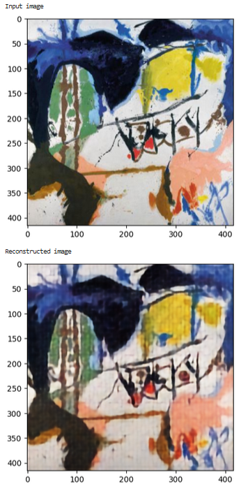
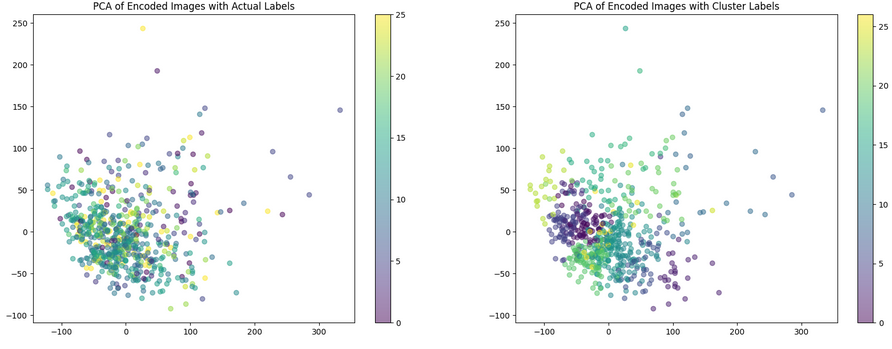
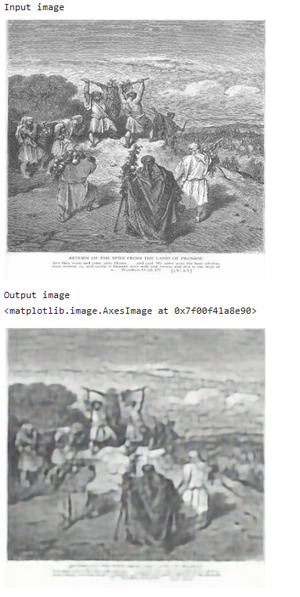

# Assignment 2 - Tova Erbén

## Data

15,274 images, 416x416 pixles
URL: https://universe.roboflow.com/art-dataset/wiki-art/dataset/2

## Bonus A: make the in-class example actually learn something

Files: `wikiart.py`, `train.py` ('train_val.py' if using validation set is not allowed), `test.py`

I tried to increase the accuracy of the base code by doing the following:
* decreasing the learning rate from 0.01 to 0.001 after learning that is the default lr for the Adam optimizer
* incresing the dropout rate from 0.01 to 0.3 (having seen recommended dropout ranges between 0.2-0.5)
* using the validation set that comes with the wikiart dataset while training the model.
  
I thought some of these changes made a big change in the accuracy (up to 8 %) but realized (a bit too late) that there seems to be too much randomness in how the model is trained and evaluated, leading to different accuracy scores every time I ran the base code's `test.py` class. Even running the code in Jupyter Notebook instead of Pythons files seemed to lead to different results. If time permitted I would have re-run all the experiments after setting a random seed.

## Part 1: fix class imbalance

File: `part1_wikiart.ipynb`

I tried to fix the class imbalance by implementing a Weighted Random Sampler (WRS). The WRS takes in an array of weights - one per dataset item - that is calculated based on the number of occurences per class. Classes with fewer datapoints can this way be assigned higher importance and possibly be picked up more than once in a single batch. The Jupyter Notebook implementation of this gave me an accuracy of ~7 % , but as mentioned above, the accuracy wasn't very consistent when running the code as Jupyter Notebook. The WRS also seems to be a rather heavy operation since many of the training runs led to `cuda:out of memory` error. 

## Part 2: autoencode and cluster represenations

File: `part2_autoencoder.ipynb`

### Implementation 

For the autoencoder part I implemented an encoder  with:
* conv2d and ReLu activation layers (if time permitted I would also have tried adding some maxpooling layers)
* a decoder that does the reverse with `ConvTranspose2d` layers
* changed the existing train function to use `MSEloss()` (mean squared error loss) to measure the reconstruction error 
* changed the existing train function to take the input image (X) as the truth when meassuring the loss
* unlike the classification task in part 1, the loss dropped considrably during training (possibly due to less complex task)
* skipped using the validation data for this part, but that could possibly have improved it even further.

### Measure

For measuring the model's ability to reconstruct images I just:
* averaged the mean sqaured error over test set
But that number didn't feel very informative (0.0044) compared to the accuracy measuremnet of the previous task. The visual inspection of a single input/output image in the test set provided a better picture of the model's abilty:

### Cluster visualization

For the clustering and its visualization, I:
* transformed the encoded images from 4D to 2D (not sure if I did that the right way) since the `Kmeans` clustering method demanded that 
* applied Principal Component Analysis for further dimensionality reduction
* used matplotlib to cluster based on actual labels as well as PCA-based cluster labels.

Judging by this visaluzation, the PCA clustering does not seem to perform terribly well.

## Part 3: generation/style transfer

File: `part3_generator.ipynb`

I was very close to throwing in the towel on this as I was having issues getting the tensor math to math, but all of a sudden it started training at least. What I did:
* copied over the code from part 2
* in the AutoEncoder class, I added a method for embedding the label (the embedding dim=16 was chosen a bit at random to start off)
* added width and height dimensions to the label to match the image tensor format
* concatenated image and label tensor --> the resulting channel dimension (512 + 16 = 528) was added to the decoder's first `Conv2d` layer's input

For evaluating it on an image with the wrong label, I did a dirty hack and created a folder called `mismatched` where I created a `Cubism` folder with a romanticism image from the test set. The resulting image is a bit hazy, but that is probably more connected to the general quality of the autoencoder from before more so than the label augmentation: 

